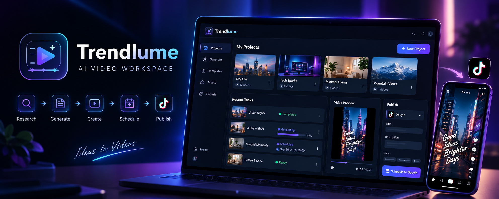
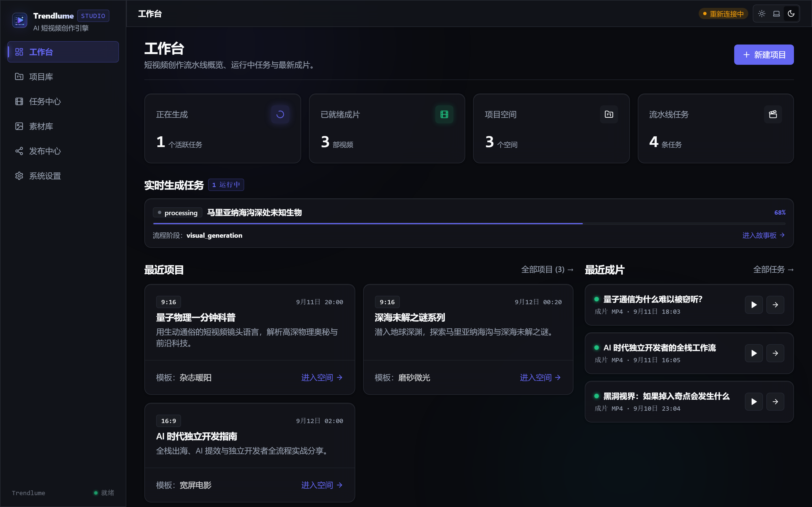
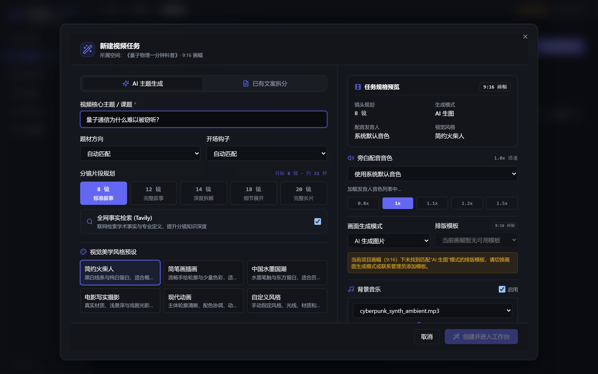
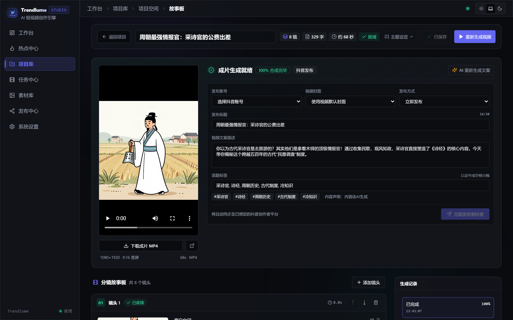
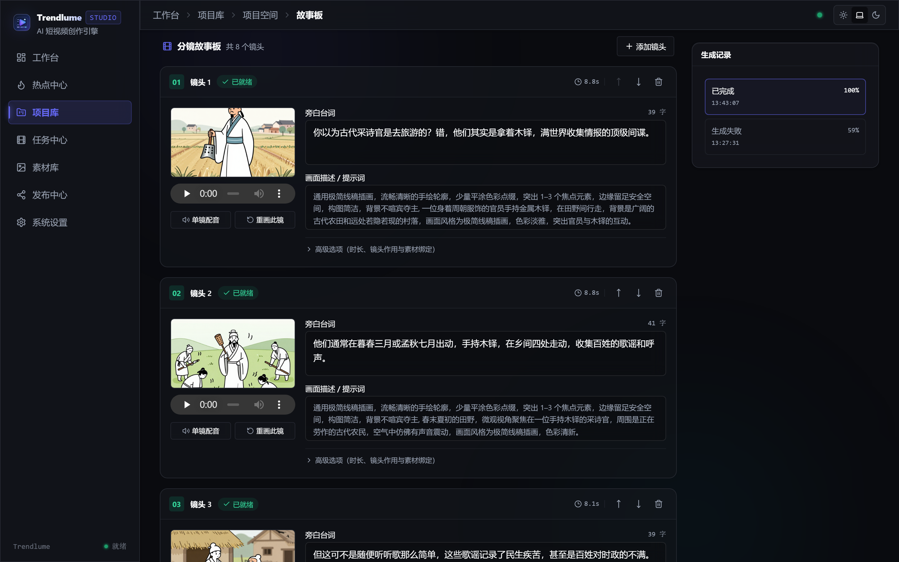
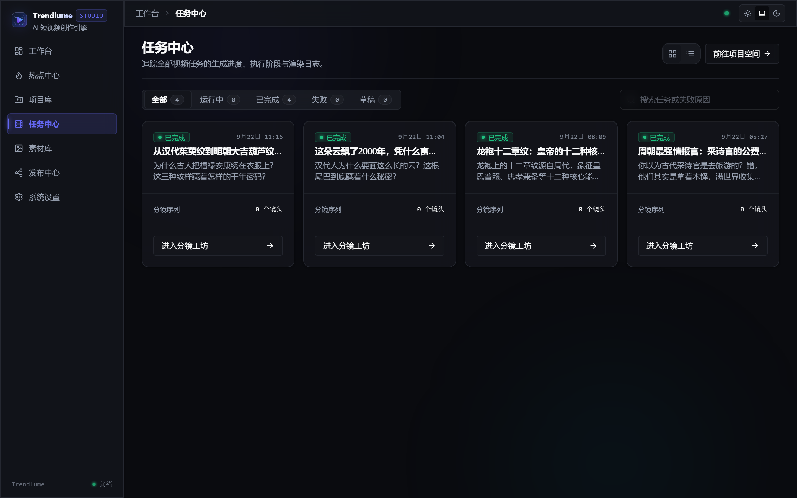
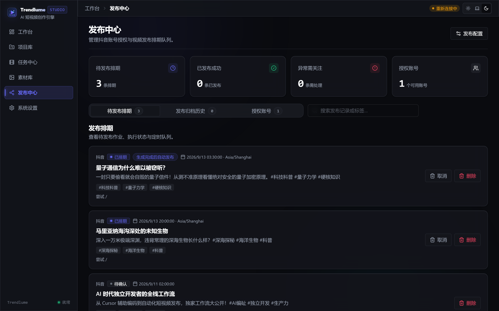
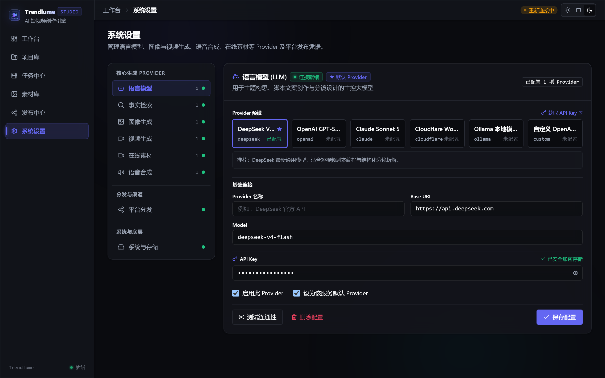
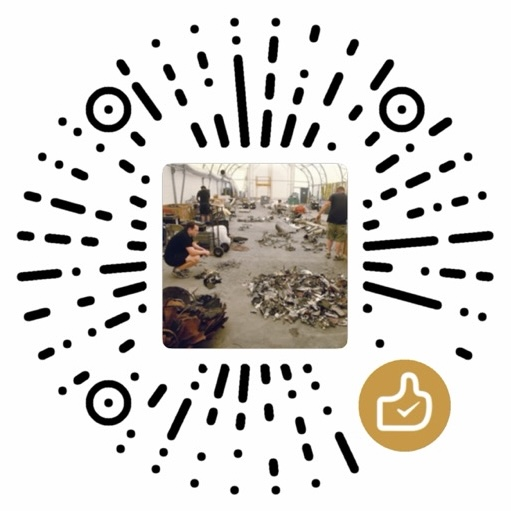

# 🎬 Trendlume

> Trendlume 是一个专为创作者设计的 AI 短视频制作与发布工作台。

你可以从全网热点捕获灵感并生成选题提案，也可以直接输入主题让 AI 联网调研，或者粘贴现成文案快速成片。每个镜头都可以在故事板中单独调整，修改局部不需要全盘重新渲染，最后直接推送到抖音发布。

[](LICENSE) [](https://www.python.org/) [](https://fastapi.tiangolo.com/) [](https://nextjs.org/) [](https://react.dev/) [](https://www.sqlite.org/) [](https://ffmpeg.org/)

<p align="center">
  <b>简体中文</b> | <a href="README_EN.md">English</a>
</p>

<p align="center">
  
</p>

## ✨ 它能为你做什么

- **三维创作起点**：支持全网热点发现（聚合 7 大平台公开热榜并生成选题提案）、主题定向扩写（联网查资料并规划分镜）、已有文案导入（直接拆解分镜），按你的习惯进入创作。
- **镜头级可视化微调**：生成的视频不是黑盒。在故事板中，你可以逐个镜头预览画面、调整时长或修改台词。换一张图或重写一句话，不会打乱其他镜头的节奏。
- **按来源选择画面**：支持 AI 生图、AI 视频、Pexels 素材库视频、纯文字排版卡片，也支持直接绑定自己的图片或视频。
- **音画字幕自动对齐**：内置免费的 Edge-TTS，也可以接入火山引擎豆包语音。系统会根据音频时长自动排布画面，并生成双语或单语字幕，支持 9:16 竖屏、16:9 横屏和 1:1 方形画幅（内置 19 种排版模板）。
- **随时暂停与局部重试**：每一步骤自动存盘。网络抖动或渲染中断后随时继续；修改第 3 个镜头的素材，不需要重新合成前面已经满意的场景。
- **直连抖音发布**：手机扫码即可授权绑定抖音创作者中心，在后台直接填写标题、话题标签、挑选封面，支持即时发布与定时排期。

## 创作工作流

```text
全网热点 ──> 选题提案 ──┐
                         ├──> 分镜脚本 ──> 故事板精修（换图/调词）
输入主题 ──> 资料调研 ──┤                          │
                         │                          │
粘贴已有文案 ────────────┘                          │
                                                    │
成片导出 / 抖音发布 <── 视频渲染合成 <── 配音与字幕生成 <───┘
```

- **全网热点**：通过公开接口获取 7 大平台实时热榜，由大模型匹配项目偏好生成切入点与大纲，确认后一键转为标准视频任务。
- **自带文案**：如果选择固定脚本模式，系统会自动跳过前期的联网调研和主题策划环节。
- **真实素材优先**：普通任务可以选择 Pexels 素材库视频，系统会根据旁白关键词自动检索并下载到任务资产；也可以直接绑定自己的图片或视频。

## 🖼️ 界面预览

| 01. 工作台总览 |
| :---: |
| <a href="docs/assets/screenshots/01-workbench-dashboard.png"></a> |
| 掌控活跃任务、项目空间与最新成片 |

| 02. 新建视频任务 | 03. 故事板工作室 |
| :---: | :---: |
| <a href="docs/assets/screenshots/02-create-task-modal.png"></a> | <a href="docs/assets/screenshots/03-storyboard-editor.png"></a> |
| 主题扩写、已有文案拆分、风格与规格配置 | 流水线全阶段监控、实时成片预览与模板微调 |

| 04. 镜头级分镜精修 | 05. 任务流水线中心 |
| :---: | :---: |
| <a href="docs/assets/screenshots/04-storyboard-scenes.png"></a> | <a href="docs/assets/screenshots/05-task-pipeline.png"></a> |
| 逐镜头调整旁白、试听配音、换图与局部重算 | 实时查看各阶段进度，支持随时暂停与重试 |

| 06. 抖音发布中心 | 07. 多 Provider 系统配置 |
| :---: | :---: |
| <a href="docs/assets/screenshots/06-douyin-publishing.png"></a> | <a href="docs/assets/screenshots/07-system-settings.png"></a> |
| 扫码绑定账号，支持话题标签与定时排期 | 一站式配置与测试 LLM、生图、素材、TTS 与发布渠道 |

## 支持的模型与服务

所有服务均在「系统配置」中心配置与测试。API Key 在本地加密存储，日志中会自动打码。

| 类型       | 支持服务                                                              | 推荐组合说明                                       |
| ---------- | --------------------------------------------------------------------- | -------------------------------------------------- |
| 全网热点   | 公开热榜                                | 覆盖微博、抖音、知乎、头条、小红书、B 站、百度，免爬虫与登录 |
| 大语言模型 | DeepSeek、OpenAI 兼容接口、Claude、Cloudflare Workers AI、本地 Ollama | 日常推荐 DeepSeek 或本地 Ollama，性价比高          |
| 选题研究   | Tavily                                                                | 用于联网检索实时信息与参考资料                     |
| 图像与视频 | 本地 ComfyUI、火山引擎 Seedream / Seedance                            | 本地有显卡可用 ComfyUI，追求省心可用火山引擎 |
| 素材库视频 | Pexels                                                                | 免费的高清实拍与视频素材库                         |
| 语音合成   | Edge-TTS（内置免费）、火山引擎豆包 TTS                                | 快速上手直接用 Edge-TTS，无需 Key 即可生成自然旁白 |
| 发布渠道   | 抖音创作者中心                                                        | 网页扫码授权，支持即时与定时发布                   |

## 🚀 快速开始

### 方式一：独立运行包（推荐，开箱即用）

内置全部依赖（无需安装 Python、Node.js、FFmpeg 或 Docker），下载解压即可运行：

1. **下载**：前往 **GitHub Releases** 下载对应操作系统的压缩包（Windows 为 ZIP，macOS / Linux 为 tar.gz；可使用随附的 `.sha256` 文件校验完整性）。
2. **运行**：解压并运行 `Trendlume` 程序（macOS / Linux 若提示权限不足，先在终端执行 `chmod +x Trendlume-*`）。
3. **使用**：程序会自动启动并在浏览器打开 [http://127.0.0.1:3000](http://127.0.0.1:3000)。首次进入「系统设置」配置 API Key 即可开始创作。

### 方式二：使用 Docker Compose

适合习惯使用 Docker 或需要在 Linux 服务器 / NAS 上部署的用户。镜像内置了后端环境、FFmpeg 和 Playwright Chromium 浏览器，无需在宿主机安装繁杂依赖。

1. **启动服务**：

   ```bash
   docker compose up --build -d
   docker compose ps
   ```

2. **开始使用**：
   
   - 浏览器打开前端页面：[http://127.0.0.1:8080](http://127.0.0.1:8080)
   - 后端健康检查地址：[http://127.0.0.1:8000/api/v1/health](http://127.0.0.1:8000/api/v1/health)
   - 首次使用请先进入右上角「设置」，填入你的大模型 API Key（比如 DeepSeek）；如果需要发视频，在发布页面扫码绑定抖音账号。
   - 查看运行日志：

     ```bash
     docker compose logs -f backend
     docker compose logs -f frontend
     ```

3. **Docker 数据持久化**

   所有运行数据均通过卷挂载持久化在宿主机项目根目录下的 **`./data`**（映射至容器内 `/app/data`）：

   - **`./data/trendlume.db`**：SQLite 数据库文件（保存任务流水线、故事板分镜与配置信息）。
   - **`./data/.credential-encryption-key`**：自动生成的凭据加密密钥；请与数据库一起备份，切勿单独删除或替换。
   - **`./data/storage/`**：生成的视频成片、音频、字幕文件及上传的素材产物。

## 🛠️ 本地开发部署

如果你需要修改代码或调试功能，可以在本地分别启动后端和前端：

### 0. 本地环境前置依赖

本地运行需先在宿主机安装以下基础工具：

| 工具 | 要求 | 说明 |
|---|---|---|
| **[Python](https://www.python.org/downloads/)** | 3.11+ | 后端运行环境 |
| **[uv](https://docs.astral.sh/uv/getting-started/installation/)** | 最新稳定版 | Python 虚拟环境与依赖管理 |
| **[Node.js](https://nodejs.org/en/download)** | 18.17+ (推荐 LTS) | 前端开发环境（自带 `npm`） |
| **[FFmpeg](https://ffmpeg.org/download.html)** | 6.0+ | 音视频合成与媒体探测（需将 `bin` 加入 PATH） |

**验证安装：**
```bash
uv --version
node --version
npm --version
ffmpeg -version
ffprobe -version
```

### 1. 准备后端

```bash
cp backend/.env.example backend/.env
```

按需修改 `backend/.env` 中的加密密钥与参数，然后启动：

```bash
cd backend
uv sync --extra dev
uv run playwright install chromium
uv run alembic upgrade head
uv run uvicorn src.api.app:app --host 127.0.0.1 --port 8000 --reload
```

> 提示：接口文档在后端 `DEBUG=true` 时可通过 `/docs` 或 `/redoc` 访问。

### 2. 启动前端

另开一个终端窗口：

```bash
cd frontend
npm ci
npm run dev
```

前端访问地址为 [http://127.0.0.1:3000](http://127.0.0.1:3000)。

## ⚠️ 安全与部署须知

> **重要提醒：切勿将本项目直接部署在可被公网访问的服务器上！**

- **无内建鉴权机制**：本项目目前定位为**本地或私有受信任网络下的单人创作工作台**，当前版本**未包含用户登录鉴权、多租户隔离与细粒度访问控制**。
- **未做完整安全审计**：项目代码尚未经历严格的安全渗透测试与安全审计。
- **建议运行方式**：请仅在个人电脑（`127.0.0.1` / `localhost`）或受保护的私有局域网内使用。如有远程访问需求，请务必前置反向代理鉴权（如 HTTP Basic Auth、OAuth2 Proxy）或借助 Tailscale / WireGuard 等安全组网工具，严禁直接暴露端口至公网。

## 📦 导出产物

每次视频生成完成后，你可以在任务详情页查看或下载以下内容：

- **最终成片**：渲染完成的高清 MP4 视频
- **独立字幕轨**：`.srt` 与 `.ass` 字幕文件，方便直接导入剪映或 Premiere 做二次精修
- **时间轴与清单**：`timeline.json` 与 `render_manifest.json`，完整记录每个分镜的音频、时长与渲染参数

## 🗺️ 后续开发计划

- [x] **全网热点 Dashboard**：采集公开平台热榜，保留原始热度与来源状态，筛选选题后直接发起视频创作。
- [ ] **适配更多 Provider**：
  - 大语言模型：接入 MiniMax、智谱 GLM、Kimi 等主流大模型及更多中转站
  - 画面生成：拓展 Midjourney、可灵 AI等更多视频与图像生成服务
  - 语音合成：拓展更多拟真且支持多情感表达的 TTS 服务
- [ ] **适配更多社交媒体平台**：增加对 TikTok、Youtube、B站 (Bilibili)、小红书、微信视频号等平台的封面适配、话题管理与一键/定时发布。
- [ ] **AI 短剧生成**：支持多集连续剧本规划、角色人物形象与服装一致性保持、分机位分镜调度以及长篇短剧连续生成。

## 📂 项目结构

```text
Trendlume/
├── backend/                          # 后端核心服务（Python 3.11+ / FastAPI）
│   ├── alembic/                      # 数据库迁移脚本
│   ├── templates/                    # HTML/CSS 动态视频排版模板（9:16 / 16:9 / 1:1）
│   ├── workflows/                    # ComfyUI 图像与视频工作流模板 (JSON)
│   └── src/                          # 后端核心源码
│       ├── api/                      # RESTful 接口层（任务、分镜、生成、热点中心、发布等）
│       ├── core/                     # 基础设施（配置读取、密钥加密、自定义异常、统一日志）
│       ├── domain/                   # 领域契约（流水线阶段、画面来源模式）
│       ├── models/                   # SQLAlchemy ORM 数据实体（任务、分镜、热点与提案、产物等）
│       ├── providers/                # 外部模型与服务适配层（严格遵循 Protocol 协议规范）
│       ├── repositories/             # 数据访问层（CRUD 数据库操作封装）
│       ├── schemas/                  # Pydantic 请求与响应数据传输对象 (DTO)
│       ├── services/                 # 核心业务逻辑（流水线、渲染、热点采集与调度、提案服务等）
│       ├── storage/                  # 统一文件存储抽象（本地持久化目录、产物检索与管理）
│       └── tasks/                    # 异步任务系统（单机 asyncio 调度器、Worker 与 SSE 事件广播）
├── frontend/                         # 前端工作台（Next.js 14 App Router / React 18 / TailwindCSS）
│   └── src/
│       ├── app/                      # 页面路由（工作台、热点中心 /trends、故事板、设置等）
│       ├── components/               # UI 组件库（分镜编辑、热点提案、工作流状态等）
│       └── lib/                      # 前端核心工具库（API 客户端、状态契约与类型定义）
├── data/                             # 运行时本地数据目录（自动创建，已忽略不提交 Git）
│   ├── trendlume.db                  # SQLite 数据库文件（WAL 模式持久化任务、配置与热点数据）
│   └── storage/                      # 生成的视频、音频、字幕、分镜快照与临时渲染产物
└── tests/                            # 自动化测试套件（单元测试、热点调度与集成回归）
```

## ℹ️ 常见说明

- **API 凭据**：除了内置的 Edge-TTS 免费可用（只需联网），大模型、生图与搜索等服务需自行提供相应平台的 API Key。热点中心默认通过公开公益接口获取，无需配置平台账号或 Cookie。
- **抖音发布**：采用官方创作者中心网页扫码授权。如果账号触发异地登录或短信二次核验，需要在手机上配合确认。
- **外部素材版权**：使用 Pexels 素材库视频时，请留意并遵守素材对应的免版税开源使用规范。
- **渲染环境**：本地源码运行时，系统依赖系统的 FFmpeg 以及 Playwright Chromium。如果生成报错提示缺少浏览器，请确认已运行 `uv run playwright install chromium`。

## 🤝 参与开发

欢迎提交 Issue 和 PR。开发约定请参考 [CONTRIBUTING.md](CONTRIBUTING.md)。
后端 Provider 适配器位于 [`backend/src/providers`](backend/src/providers)，前端交互逻辑位于 [`frontend/src`](frontend/src)。

## ☕ 赞助与支持

如果 Trendlume 对你的短视频创作或开发工作有所帮助，欢迎赞助支持项目的持续迭代与功能扩展！如果你想进行其他形式的赞助或合作，欢迎通过邮箱与我联系：[colin0921@outlook.com](mailto:1370227996@qq.com)。

|                       微信支付 (WeChat Pay)                        |                        支付宝 (Alipay)                        |                            PayPal                             |
| :----------------------------------------------------------------: | :-----------------------------------------------------------: | :-----------------------------------------------------------: |
|  |  |  |

## 🙏 致谢

本项目参考了以下开源项目，在此表示感谢：

- [MoneyPrinterTurbo](https://github.com/harry0703/MoneyPrinterTurbo)
- [Pixelle-Video](https://github.com/ATH-MaaS/Pixelle-Video)
- [Easel](https://github.com/ZJU-REAL/Easel)
- [social-auto-upload](https://github.com/dreammis/social-auto-upload)

## 📄 许可证

本项目遵循 [Apache License 2.0](LICENSE) 开源许可证。
